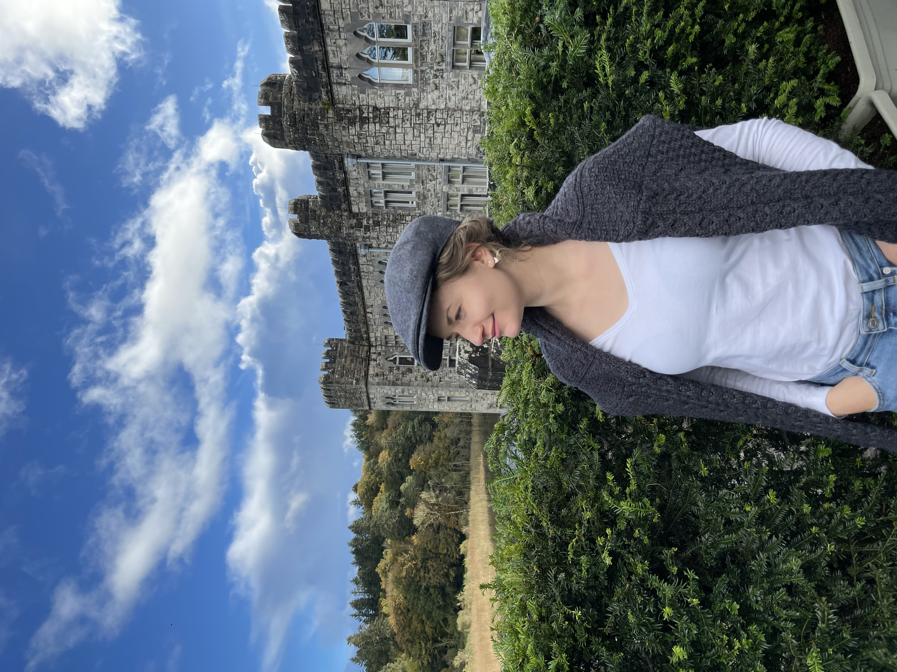
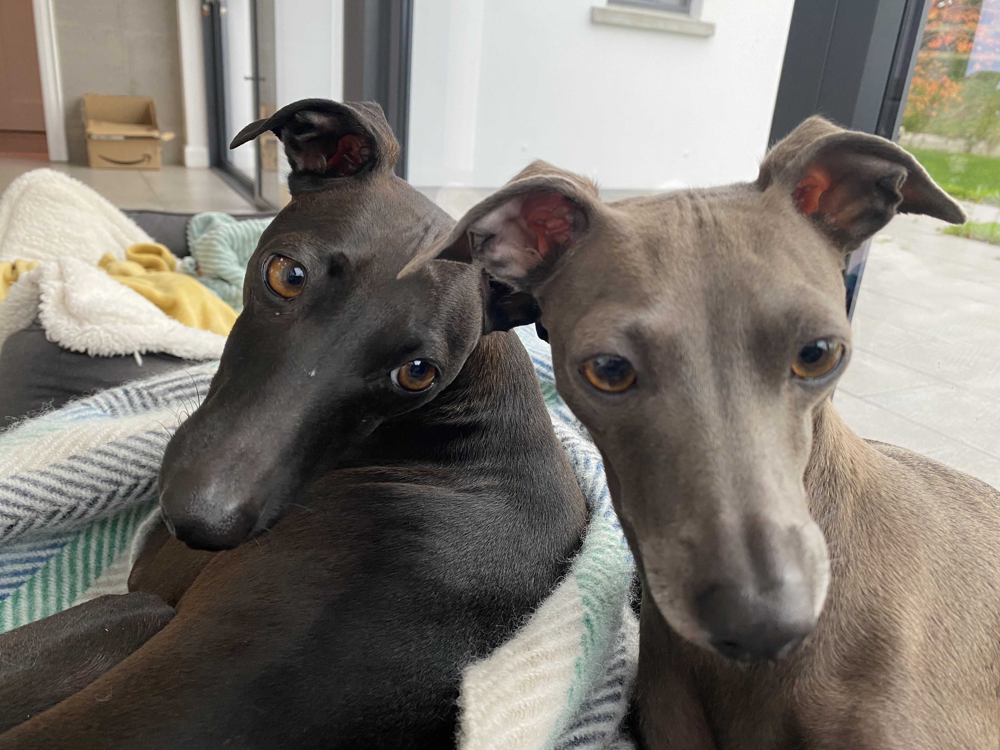

## Background
<!-- 


 -->

Hi, I'm Martyna and I’m a language nerd.

I discovered that reading poetry isn’t as cool as it used to be a few centuries ago so I switched to Machine Learning (ML).

On a more serious note, I’m a linguist who journeyed into the world of Natural Language Processing (NLP) and Conversational Artificial Intelligence (AI) and managed to dig so many rabbit holes in the process that I wanted to share some of those explorations with you. Thank you for coming. _Would you like a cup of tea?_

My interests span: NLP, AI assistants, translation, knowledge management, and more. These all sound like very lofty and aloof subjects but I promise you there is a job in there. I might weave into those topics some reflections on inclusion because of [my personal journey](https://owntrail.com/trail/convoluted_m).

_P.S._ If you are wondering how to pronounce my first name (let’s start with the easier one), please click on the icon below:


<figure>
    <audio controls src="images/name-pronunciation.m4a" type="audio/mpeg">
        Your browser does not support the <code>audio</code> element.
    </audio>
</figure>


And if you’d like to geek out a bit more, here are two pronunciations of my name:

Polish using the Slavic phonetic alphabet (AS)

> /mar‘tyna/

...and the anglicised version using the International Phonetic Alphabet (IPA)

> /ma:(r)‘ti:nə/

More on phonetic alphabets for [Polish transcription by Grzegorz Jagodziński](http://grzegorz.jagodzinski.prv.pl/gram/en/ipa.html).

## Convoluted Meanings

If you'd like to know about the idea behind the name of the blog, why don't you hop over to the [post on it](https://convolutedmeanings.com/meta/why-convoluted-meanings/).

## Life

I’m passionate about the philosophy and science of the mind. I basically love cool pictures of the brain with words like ‘Broca’s area’ written on them. Oh and mandalas. My limbic system gets really excited when I get hold of a book that [marries Western scientific thought with the ancient wisdom of the East](http://cup.columbia.edu/book/contemplative-science/9780231138352). I’m a beginner on the yoga mat. I passionately read about [neuropeptides that are the link between the body and the mind](https://www.smithsonianmag.com/arts-culture/review-of-molecules-of-emotion-157256854/), and that knock the [Cartesian dualism](https://en.wikipedia.org/wiki/Mind%E2%80%93body_dualism) off the contemplative shelf.

### Speaking my voice





Since I can remember I have scribbled verses, first to make them rhyme, then to not rhyme them (!!) and finally letting them flow in whatever shapes they come about, picturing the images in my head. I love poetry and I can't paint. And I am an amateur. I love [reading poetry](https://soundcloud.com/user-797325276/dorothea-dubois-amazonian-gift) to the window and to the surprise of two Italian Greyhounds. And to the [camera](https://www.youtube.com/watch?v=XYWkPdYxGQw).

PS I recently started experimenting with singing, I feel I’m onto something...

### Walking my path

I feel at home in the hills and mountains and I’ve been compared to a goat (which I believe is a compliment). I also strongly believe in walking our path in life, staying true to ourselves, and learning to be compassionate.

### Finding balance

 My personal story coupled with my philosophical interests has put me on a path of exploring the nature of the mind (or shall I say the body-mind), purpose and meaning. Our western culture has only recently started creating space for finding more balance between the different parts of our "self" and different areas of life. I hope to share some of my reflections and learnings on this journey. The name of the blog says it all. We are such a beautiful mosaic of interests, experiences and revelations.

_Thank you for popping in._ 🫖