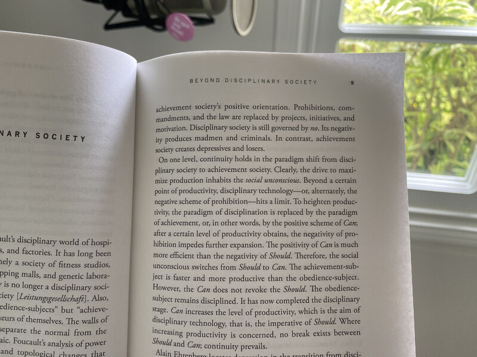

## How is our "achievement society" driving product design and the evolution of tech? 

Byung-Chul Han starkly outlines this dominant paradigm in his "Burnout Society". If the chief goal of existence is to produce for consumption (vs. create for expression and nurturance), then we set in motion an army of hungry ghosts. If we see ourselves from a purely functionalist perspective, if achievement is the highest stake, then the products we create support that narrative. 

Where does human-centric design sit within this frame? What products would we build if we believed that our purpose in life is to respectfully 🟢 experience, 🟢 connect, and 🟢 expand our horizons? I'm throwing big philosophical question marks in here, not pointing out my smart nose.

